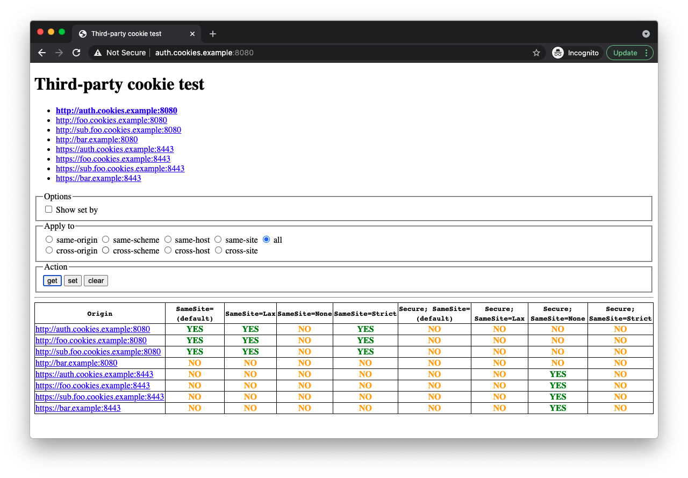
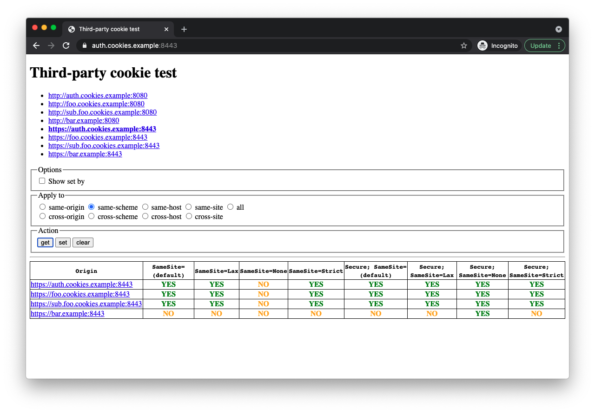
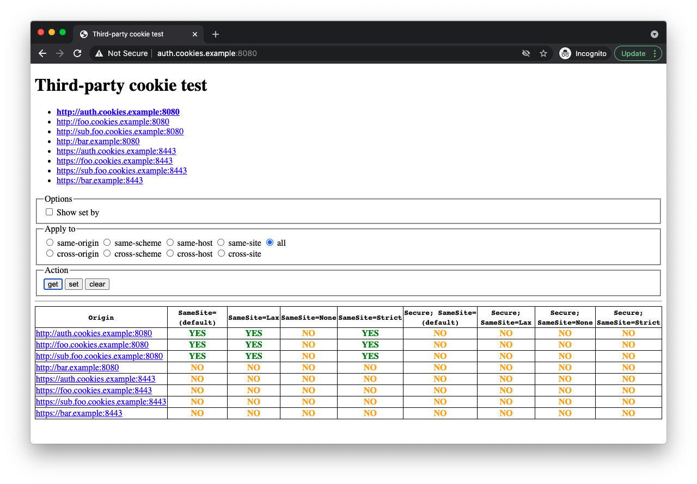
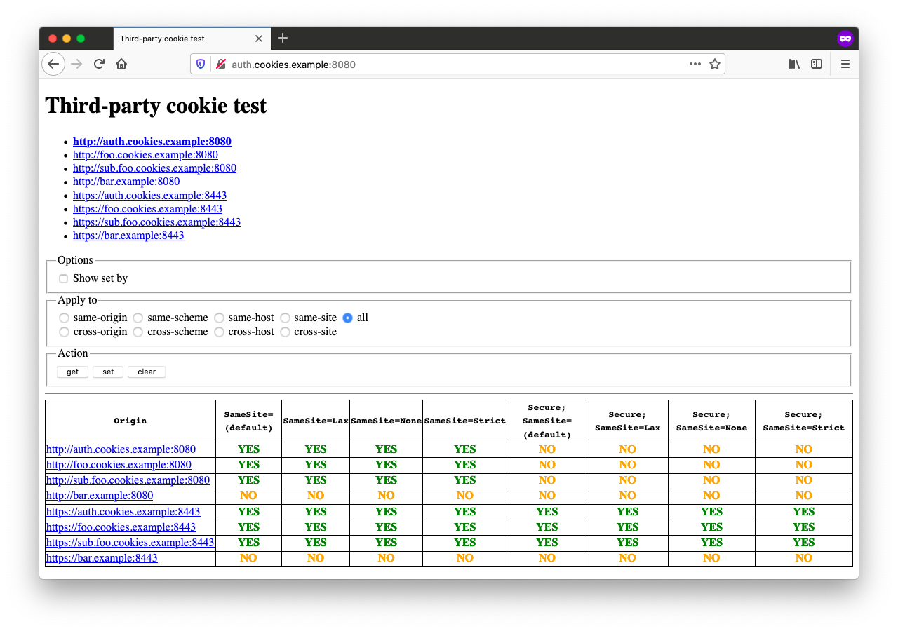
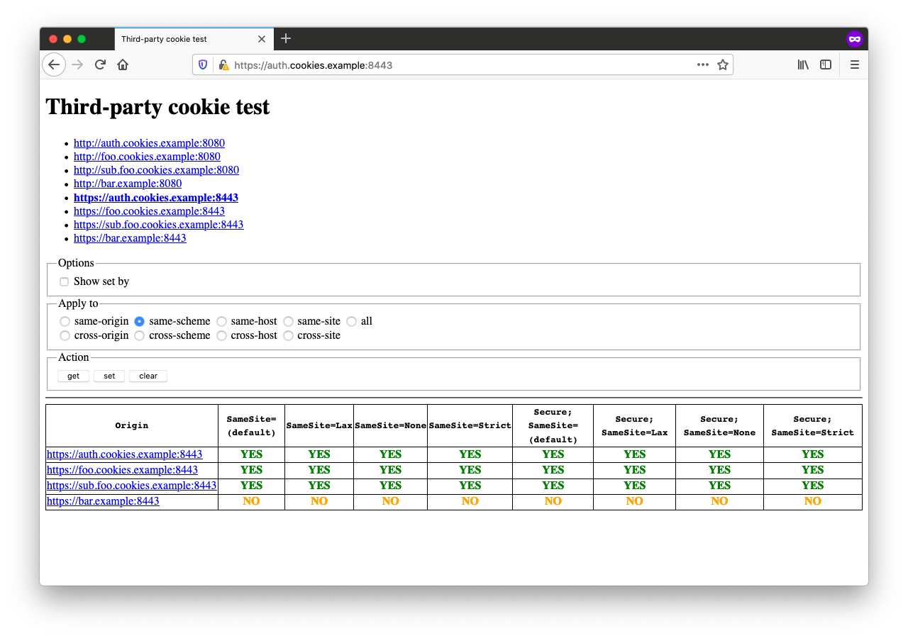

# third-party-cookie-test

This repository allows developers to test the behavior of cookies in browsers in the context of the third-party cookies phase out ([Chrome](https://blog.chromium.org/2020/01/building-more-private-web-path-towards.html) / [Firefox](https://blog.mozilla.org/en/products/firefox/todays-firefox-blocks-third-party-tracking-cookies-and-cryptomining-by-default/)) and state partitioning ([Chrome](https://docs.google.com/document/d/1V8sFDCEYTXZmwKa_qWUfTVNAuBcPsu6FC0PhqMD6KKQ) / [Firefox](https://developer.mozilla.org/en-US/docs/Web/Privacy/State_Partitioning)).

## Requirements

- Node.js 12+
- OpenSSL

## Quick start

Add the following to your `/etc/hosts` file:

```
127.0.0.1 auth.cookies.example
127.0.0.1 foo.cookies.example
127.0.0.1 sub.foo.cookies.example
127.0.0.1 bar.example
```

Then run `npm start` and visit http://auth.cookies.example:8080 using a web browser.

You may need to trust the generated certificate in `cert.pem` for HTTPS to work on some web browsers like Chrome.
In macOS, double click `cert.pem` to import it to your key chain, and then [change the trust setting](https://support.apple.com/guide/keychain-access/change-the-trust-settings-of-a-certificate-kyca11871/mac) of **Secure Sockets Layer (SSL)** to **Always Trust**.

You may need to add HTTPS trust exceptions in other browsers like Firefox.
To do so, visit each of the following URLs and add an exception:

- https://auth.cookies.example:8443
- https://foo.cookies.example:8443
- https://sub.foo.cookies.example:8443
- https://bar.example:8443

## Concepts

The following section summarizes some important concepts relevant to cookies in the context of security and privacy:

### URL

A [URL](https://developer.mozilla.org/en-US/docs/Glossary/URL) is text string that specifies where a resource (such as a web page, image, or video) can be found on the Internet.
It consists of many [components](https://url.spec.whatwg.org/#url-representation), which can be summarized with a practical example.

For example, take the following URL:

```
https://www.example.com:8443/some/resource?foo=bar&hello=world#baz
```

The URL components are as follows:

- **scheme** (a.k.a. **protocol**): `https`
- **authority:** `www.example.com:80`
  - **host** (a.k.a. **domain**, **domain name**, **host name**): `www.example.com`
  - **port**: `8443`
- **path**: `/some/resource`
- **query** (a.k.a. **parameters**, **query parameters**, **query string**, **search params**): `foo=bar&hello=world`
- **fragment** (a.k.a. **anchor**, **hash**): `baz`

### origin

The [origin](https://developer.mozilla.org/en-US/docs/Glossary/Origin) component of a URL consists of its scheme and authority.
In the context of web browsers, it refers to the origin component of the URL displayed in the address bar at the top.
Browsers include this value in the [origin header](https://developer.mozilla.org/en-US/docs/Web/HTTP/Headers/Origin) of requests under some conditions.

For example, the origin of the example URL is: https://www.example.com:8443

### site

A [site](https://developer.mozilla.org/en-US/docs/Glossary/Site) – a.k.a. [eTLD+1](https://web.dev/same-site-same-origin/#site) (effective top-level-domain+1) or [registrable domain](https://url.spec.whatwg.org/#host-registrable-domain) – refers to the subset of a URL's host component that contains a public suffix according to a [public suffix list](https://publicsuffix.org/) plus one additional level.

For the example URL, `www.example.com` is the host, `com` is the public suffix, and `example.com` is the site.

### same-origin

Two URLs have the same origin if their corresponding origin components are equal.
This concept is key for the security model implemented by web browsers named [same-origin policy](https://developer.mozilla.org/en-US/docs/Web/Security/Same-origin_policy).

For example:

- https://www.example.com/foo and https://www.example.com/bar have the same-origin.
- http://www.example.com/ and https://www.example.com/ do not have the same-origin because their scheme is different.

### same-site

This an ambiguous term which refers to one of two things: schemelessly same-site and schemeful same-site.

#### schemelessly same-site

Two URLs are said to be [schemelessly same-site](https://html.spec.whatwg.org/multipage/origin.html#sites) if their sites are equal.

For example:

- The following URLs are schemelessly same-site because their eTLD is `com`, making their site `example.com`: https://example.com, https://foo.example.com, and https://bar.example.com.
- The following URLs are not schemelessly same-site because their eTLD is `github.io`, making their sites `foo.github.io` and `bar.github.io` respectively: https://foo.github.io and https://bar.github.io.

#### schemeful same-site

Two URLs are said to be [schemeful same-site](https://web.dev/same-site-same-origin/#%22schemeful-same-site%22) if their schemes and sites are equal.

For example:

- The following URLs are schemeful same-site: https://foo.example.com and https://bar.example.com
- The following URLs are not schemeful same-site because their schemes differ: http://foo.example.com and https://bar.example.com

### cross-origin request

Refers to a request made by a web browser from one origin to a target URL with a different origin.
Directly typing a URL in the address bar is never considered a cross-origin request.
On the other hand, any request originating from a web page may be considered a cross-origin request.
Some examples include:

- Requests sent by the browser while loading a web page: ``, `<link>`, `<script>`, `<video>`, etc.
- Requests sent by the browser in response to user events: `<a>` click, `<form>` post, etc.
- Requests sent by a script running in a web page: `<script>`, `SharedWorker`, `Worker`, etc.

For example, if a `<script>` in https://foo.example.com makes a request to a target URL https://bar.example.com, it is said to be a cross-origin request.

Cross-origin requests sent by scripts (via [XMLHttpRequest](https://developer.mozilla.org/en-US/docs/Web/API/XMLHttpRequest) or [fetch](https://developer.mozilla.org/en-US/docs/Web/API/WindowOrWorkerGlobalScope/fetch)) are disallowed by default, but can be selectively allowed via [CORS](https://developer.mozilla.org/en-US/docs/Web/HTTP/CORS).

Note that in the context of requests sent by a script, the origin of a request refers to the origin component of the URL displayed in the address bar of the web browser and not the URL of the script itself (e.g. the `src` attribute of a `<script>`).

### cross-site request

Refers to a request made by a web browser from one site to a target URL with a different site.
Directly typing a URL in the address bar is never considered a cross-site request.
On the other hand, any request originating from a web page may be considered a cross-site request.

For example, if a user clicks on a link (`<a>`) in https://foo.example with an `href` attribute pointing to https://bar.example, the request sent by the browser is said to be a cross-site request.

Just like in cross-origin requests, in the context of requests sent by a script, the origin site of a request refers to the site of the URL displayed in the address bar of the web browser and not the URL of the script itself (e.g. the `src` attribute of a `<script>`).

Note that since same-site is an ambiguous concept, the comparison done by browsers to determine whether a request is a cross-site request can be schemelessly (site) or schemeful (scheme + site).

### third-party cookie

Refers to cookies sent by web browsers in cross-site requests (via the [cookie](https://developer.mozilla.org/en-US/docs/Web/HTTP/Headers/Cookie) header) or set by servers (via the [set-cookie](https://developer.mozilla.org/en-US/docs/Web/HTTP/Headers/Set-Cookie) header) in response to those requests.

In practice, a web browser configured to block third-party cookies, will not block cookies for same-site requests.

Note that since same-site is an ambiguous concept, the act of blocking third-party cookies can vary on each browser.
For example, Chrome 90 uses schemeful same-site comparisons to determine if a cookie is a third-party cookie while Firefox 78-esr and Firefox 88 use schemelessly same-site comparisons.

## Example run

The following section contains notable highlights of cookie behavior for the following browsers: Chrome 90, Firefox 78-esr, and Firefox 88.

- All browsers support the `Clear-Site-Data` header only in secure (i.e. `https://`) responses.
- All browsers do not store cookies from insecure (i.e. `http://`) responses that contain the `Secure` attribute.
- All browsers do not send third-party cookies with `fetch()` when their `SameSite` attribute is set to `Lax` or `Strict`.
- Chrome does not store cookies with `SameSite=None` when the `Secure` attribute is missing.
- Chrome uses schemeful same-site comparison, whereas Firefox uses schemelessly same-site comparison when blocking third-party cookies.
- Chrome sets the `SameSite` attribute to `Lax` when omitted, whereas Firefox sets it to `None`.
- Firefox 88 performs state partitioning when configured in **Strict** or **Custom** mode.

### Chrome 90 (allow all cookies)





### Chrome 90 (block third-party cookies)




### Firefox 78-esr (allow all cookies)


### Firefox 78-esr (block third-party cookies)




